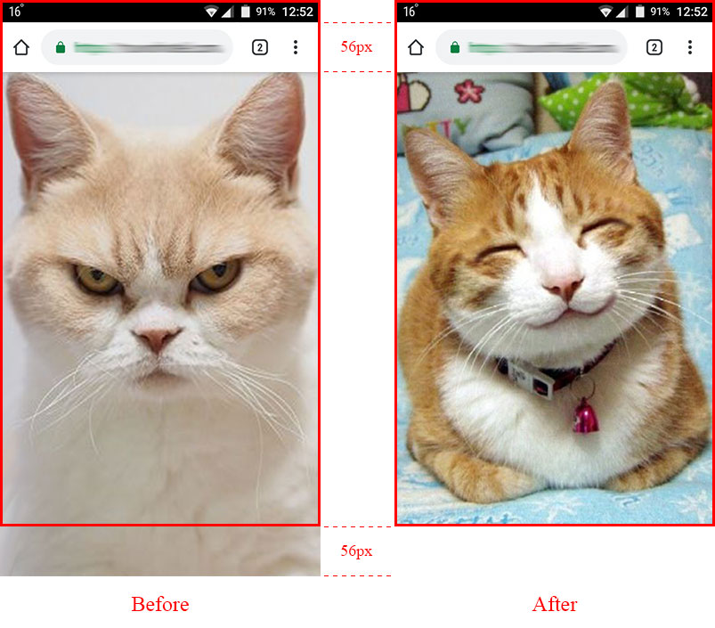

# 100vh problem solution

## About the problem

All browsers on mobile devices have a top menu. This menu shifts the viewport,
and it goes beyond the screen. Therefore, elements with a height of 100vh extend
beyond the screen.



Red rect is the size of the screen.

[More Info](https://stackoverflow.com/questions/37112218/css3-100vh-not-constant-in-mobile-browser)

## Solution

The function calculates the size of the offset and corrects the height of
the element, if necessary.

```javascript
document.addEventListener('DOMContentLoaded', function () {
    cssvh(document.getElementById('some-id'), 100);
});
```

After that div#some-id.style.height will be calc(100vh - {topMenuHeight}px).

## Examples

100vh

```javascript
document.addEventListener('DOMContentLoaded', function () {
    cssvh(document.getElementById('some-id'), 100);
    // this is the same, the second argument is 100 by default
    cssvh(document.getElementById('some-id'));
});
```

calc(100vh - 50px)

```javascript
document.addEventListener('DOMContentLoaded', function () {
    cssvh(document.getElementById('some-id'), 100, 50);
});
```

## License

MIT